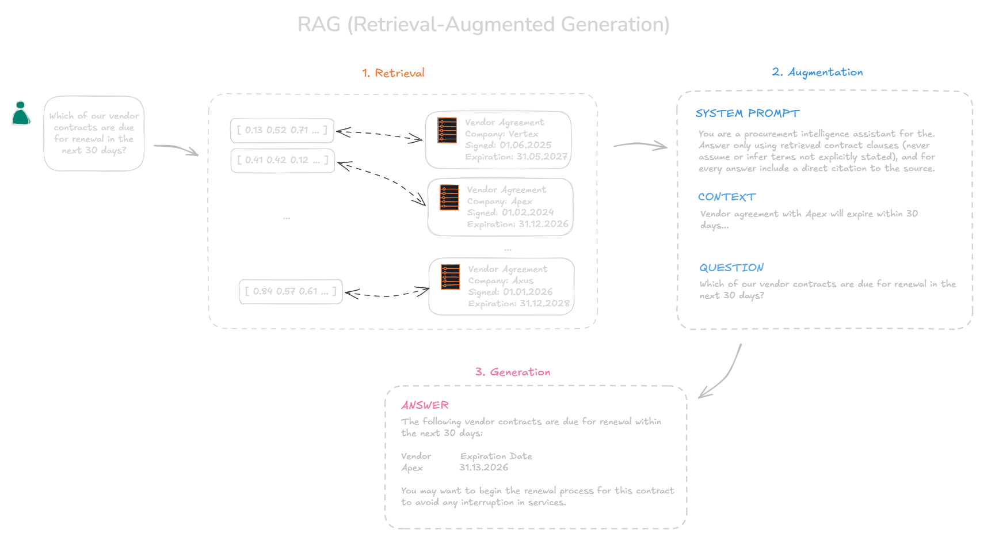

**Retrieval augmented generation (RAG)** is an architectural pattern that combines search capabilities with large language models (LLMs) generative potential in order to return most accurate and current response.

The idea of RAG (Retrieval-Augmented Generation) was introduced in 2020 to overcome a key limitation of large language models (LLMs): their reliance on knowledge contained only in their training data. Instead of trying to "embed" all knowledge into the model's parameters, the RAG approach enables the model to retrieve up-to-date information from external sources (knowledge bases) during response generation. This approach is particularly valuable for organizations that possess proprietary data or domain-specific knowledge that should be grounded into the model's responses.

Lets review the following use case. A procurement director at Contoso asks:

> "Which of our vendor contracts are due for renewal in the next 30 days?"

A language model cannot answer this question on its own because it has no access to Contoso's internal contract data. Instead, the application retrieves the relevant contract records from the company's data store and provides them to the model along with the user's question. Using this additional context, the model can identify the contracts that are approaching their renewal dates and generate an accurate, relevant response.

## Key concepts for RAG

**Grounding data** - retrieved content provided to the language model to help it answer a specific question. In a RAG system, grounding data typically comes from documents, databases, knowledge bases, or other enterprise data sources.

**Index** - data structure that organizes content so it can be searched efficiently (keyword, semantic, vector, or hybrid search). Rather than scanning every document for each user query, the retrieval system searches the index to quickly identify the most relevant pieces of information.

**Embeddings** - numerical representations of text that capture its meaning. Texts with similar meanings are represented by vectors that are close to one another in the embedding space, even if they use different words. This makes it possible to retrieve documents based on semantic similarity instead of relying only on exact keyword matches.

**System message and prompts**: System messages are instructions that define overall behavior of the model and how it uses retrieved content. The prompt contains the task-specific input, including the user's question. Together, they guide the model in producing responses that are accurate, relevant, and aligned with the application's requirements.

## RAG follows a three-step flow

### 1. Retrieve

When a user asks a question, system queries an index to find relevant content. The user's query is converted into an embedding (represented by vector) using the same approach, that was used to index the documents. This vector is then compared with the vectors stored in the database to find the content that is most similar in meaning. Modern vector databases can perform this search across millions or even billions of embeddings in just a few milliseconds. The retrieved results may be filtered or re-ranked before the most relevant pieces of information are passed to the language model as context.

### 2. Augment

The retrieved information (grounding data) is combined with the user's question to create an enriched prompt for the language model. Using both the query and the additional context, the model generates a response that is grounded in the retrieved knowledge rather than relying solely on its training data.

### 3. Generate

The model receives the augmented prompt and generates its response using both its internal knowledge and the external context provided in the prompt. Rather than simply repeating the retrieved content, it combines and rephrases the information to produce a clear, coherent answer that addresses the user's question.

## Agentic RAG: modern approach to retrieval

Traditional RAG typically retrieves information using a single search query. Agentic RAG improves on this approach by breaking complex requests into multiple focused queries, retrieving information from different sources in parallel, and combining the results into a richer context for the language model.
